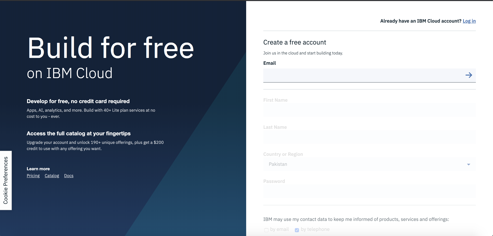
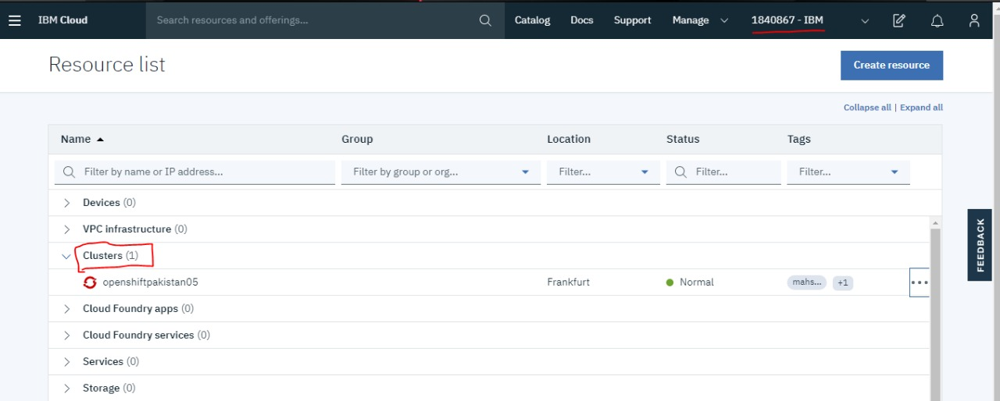
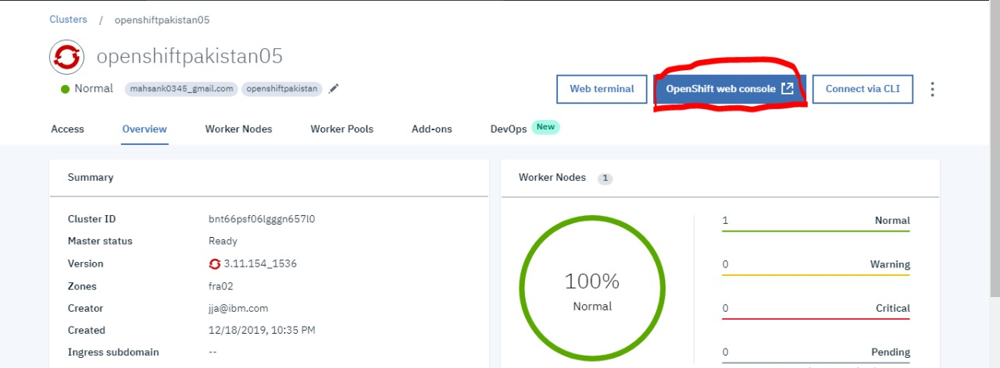
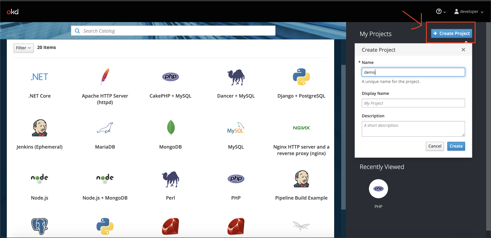
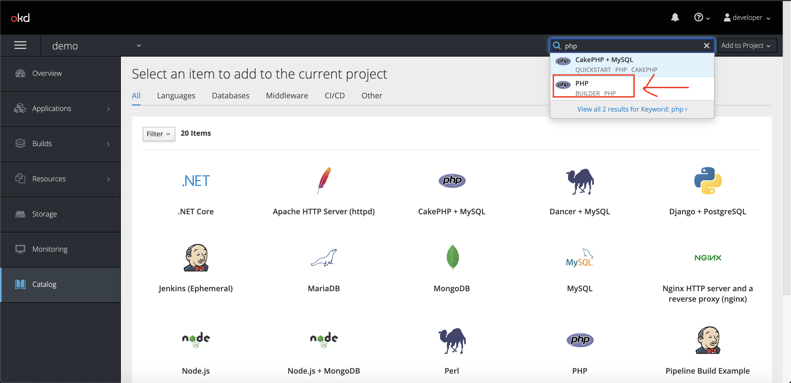
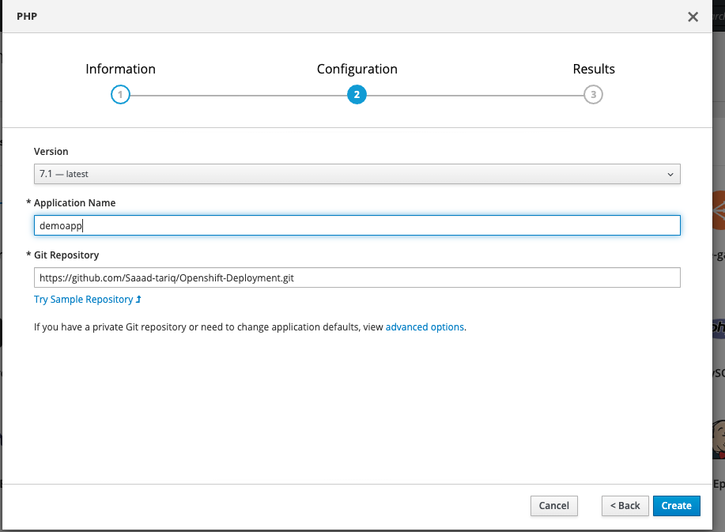
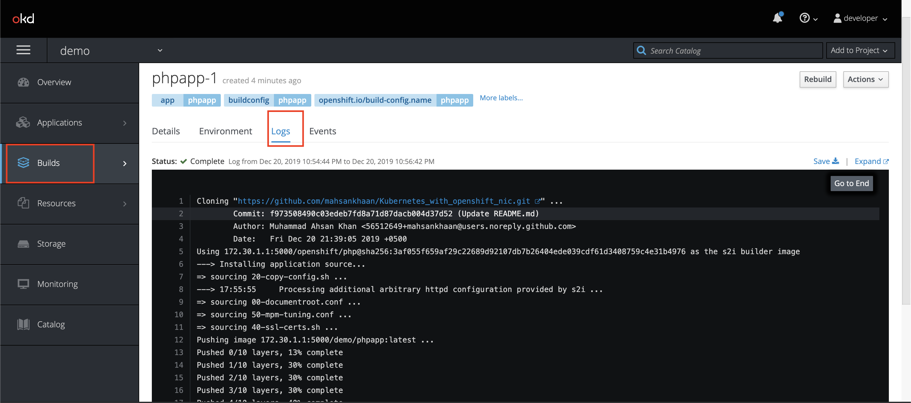
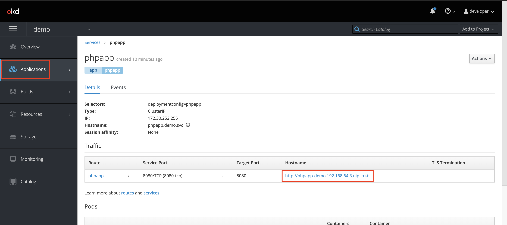

# Deploy Cloud-Native Application using Red Hat OpenShift on IBM Cloud
Let's deploy simple php application on Openshift cluster

## Follow these steps:

## Step 1 : Sign-up for IBM Cloud Platform 

[http://ibm.biz/BdqKHM](http://ibm.biz/BdqPB7)

## Step 2 : Go to resources and the see your cluster must be there

## Step 3: Select the cluster and open web console

## Step 4: On web console you will able to see openshift dashboard ,next select create project

## Step 5: Get into your newly created project and next on top search for PHP Builder

## Step 6: In Configuration
1. Application name : demoapp
2. Git Repository: https://github.com/Saaad-tariq/Openshift-Deployment.git

## Step 7: Select Build->log and check if image is successfully build

## Step 8: Select Application->services and then Hostname link

