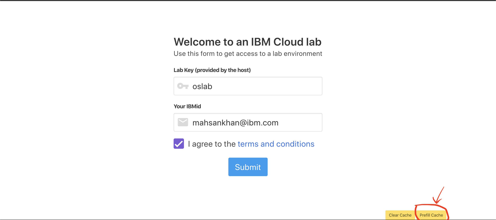
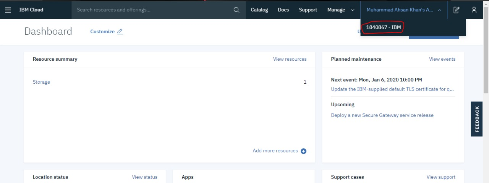
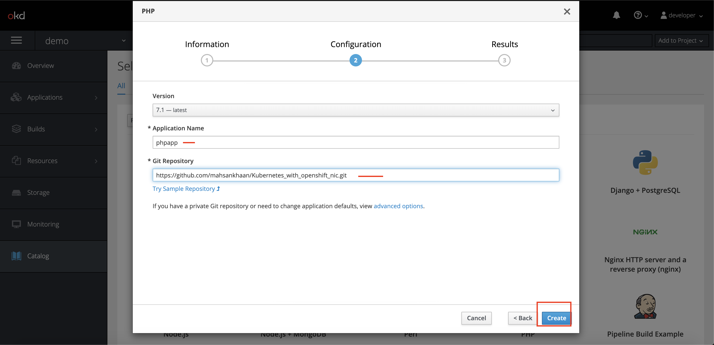

# (Urdu): Deploy Cloud-Native Application using Red Hat OpenShift on IBM Cloud
Let's deploy simple php application on Openshift cluster

## Follow these steps:

## Step 1 : Sign-up for IBM Cloud Platform 

[http://ibm.biz/BdqPB7](http://ibm.biz/BdqPB7)

## Step 3: Please be sure to click: Prefill Cache button on the URL before submit

## Step 5: Login into your IBM account and you will able to see external account then select it

## Step 6 : Go to resources and the see your cluster must be there

## Step 7: Select the cluster and open web console

## Step 8: On web console you will able to see openshift dashboard ,next select create project

## Step 9: Get into your newly created project and next on top search for PHP Builder

## Step 10: In Configuration
1. Application name : phpapp
2. Git Repository: [https://github.com/mahsankhaan/Kubernetes_with_openshift_nic.git](https://github.com/mahsankhaan/Kubernetes_with_openshift_nic.git)

## Step 11: Select Build->log and check if image is successfully build

## Step 12: Select Application->services and then Hostname link

## Step 13: Finally your application is running on Openshift

